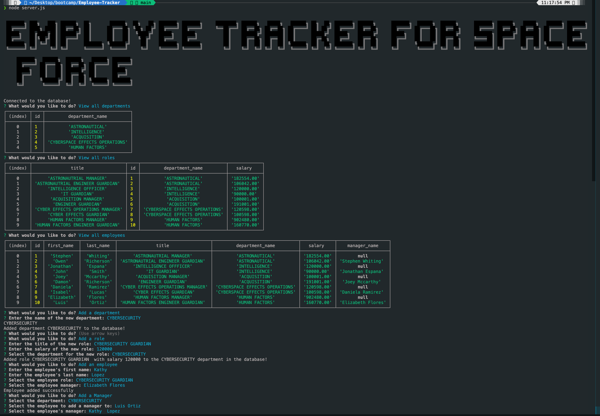

# Employee-Tracker

[](https://opensource.org/licenses/MIT)

  
## Overview of Employee Tracker 

## User Story
```
AS A business owner
I WANT to be able to view and manage the departments, roles, and employees in my company
SO THAT I can organize and plan my business

```

## Acceptance Criteria
```
GIVEN a command-line application that accepts user input
WHEN I start the application
THEN I am presented with the following options: view all departments, view all roles, view all employees, add a department, add a role, add an employee, and update an employee role
WHEN I choose to view all departments
THEN I am presented with a formatted table showing department names and department ids
WHEN I choose to view all roles
THEN I am presented with the job title, role id, the department that role belongs to, and the salary for that role
WHEN I choose to view all employees
THEN I am presented with a formatted table showing employee data, including employee ids, first names, last names, job titles, departments, salaries, and managers that the employees report to
WHEN I choose to add a department
THEN I am prompted to enter the name of the department and that department is added to the database
WHEN I choose to add a role
THEN I am prompted to enter the name, salary, and department for the role and that role is added to the database
WHEN I choose to add an employee
THEN I am prompted to enter the employee’s first name, last name, role, and manager, and that employee is added to the database
WHEN I choose to update an employee role
THEN I am prompted to select an employee to update and their new role and this information is updated in the database 
```
## Table of Contents

- [Description](#description)
- [Links](#links)
- [Installation](#installation)
- [Usage](#usage)
- [Credits](#credits)
- [Contact me](#contact-me)


  
## Description

 Employee Tracker for Space Force is a employee data tracker to help users show which employee and manager are in the United States Space Force. It allows to view employee and managers to see which each role ,department ,salary they are in. 
 
## Links
- [The URL of Github Repository](https://github.com/kathylopez97/Employee-Tracker)
- [Youtube Video Walkthrough](https://www.youtube.com/watch?v=oSJwXXfOJ9c)

## Installation 

Instructions on how to use the Employee Tracker for Space Force


2. Clone the repo
   ```sh
   git clone https://github.com/kathylopez97/Employee-Tracker
   ```
3. Install NPM packages

   ```sh
   npm i 
   ```

4. To run Employee Tracker
   ```sh
   node server.js
   ```
## Usage 

## Credits 
- Youtube: [Youtube](https://youtube.com)
- Visual Studio Code: [VS Code](https://code.visualstudio.com/)
- Professional README Guide: [README.md](https://coding-boot-camp.github.io/full-stack/github/professional-readme-guide)
- Professional  Video Guide Submisson: [VideoGuide](https://coding-boot-camp.github.io/full-stack/computer-literacy/video-submission-guide)


## Contact me
<!-- I hope you all like it! -->


Contact me If you have any questions or additional feedback.
- [Github](https://github.com/kathylopez97)
- [Email](kathyylopezz97@gmail.com)
